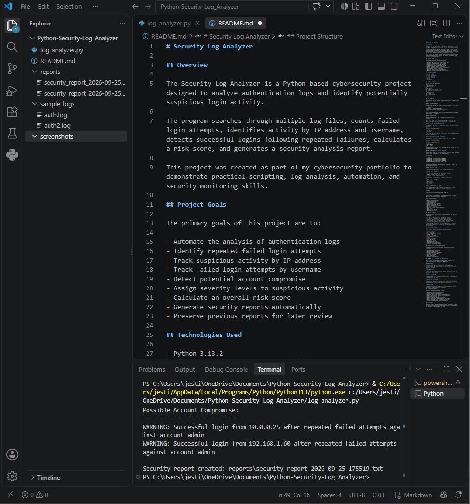
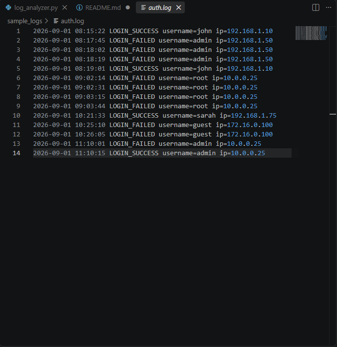
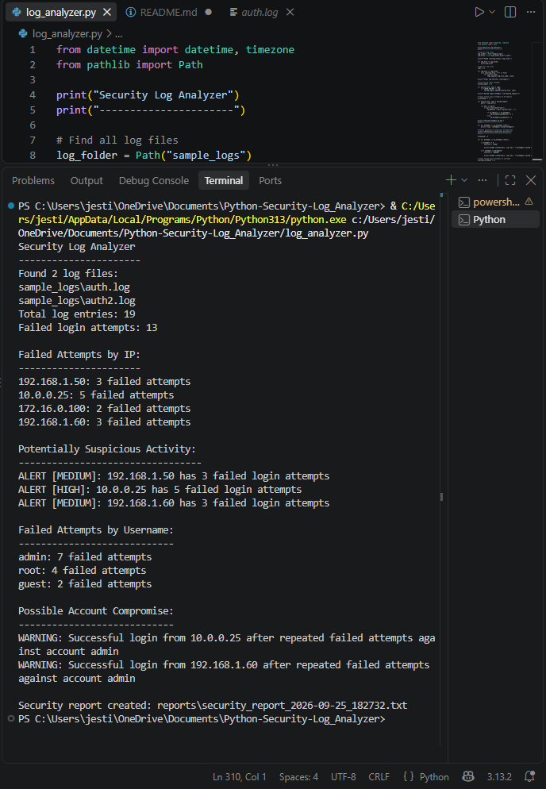
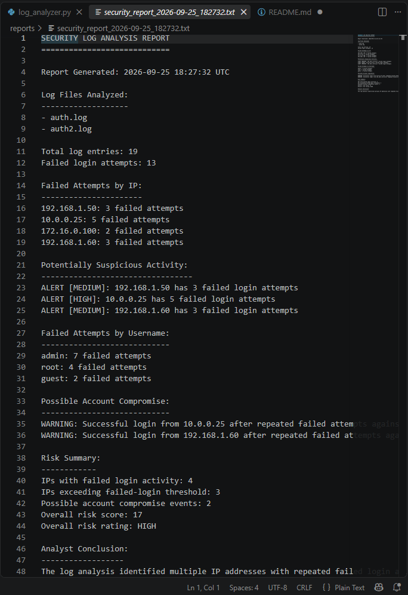

# Security Log Analyzer

# Overview

The Security Log Analyzer is a Python-based cybersecurity project designed to analyze authentication logs and identify potentially suspicious login activity.

The program searches through multiple log files, counts failed login attempts, identifies activity by IP address and username, detects successful logins following repeated failures, calculates a risk score, and generates a security analysis report.

This project was created as part of my cybersecurity portfolio to demonstrate practical scripting, log analysis, automation, and security monitoring skills.

# Project Goals

The primary goals of this project are to:

- Automate the analysis of authentication logs
- Identify repeated failed login attempts
- Track suspicious activity by IP address
- Track failed login attempts by username
- Detect potential account compromise
- Assign severity levels to suspicious activity
- Calculate an overall risk score
- Generate security reports automatically
- Preserve previous reports for later review

# Technologies Used

- Python 3.13.2
- Visual Studio Code
- Python `pathlib`
- Python `datetime`
- GitHub
- Windows 11

## Project Structure

```text
Python_Security_Log_Analyzer
│
├── log_analyzer.py
├── README.md
│
├── reports
│   ├── security_report_2026-09-25_175455.txt
│   ├── security_report_2026-09-25_175519.txt
│   └── security_report_2026-09-25_182732.txt
│
├── sample_logs
│   ├── auth.log
│   └── auth2.log
│
└── screenshots
    ├── 01_project_structure.png
    ├── 02_sample_authentication_logs.png
    ├── 03_analyzer_execution.png
    └── 04_generated_security_report.png
```

# How It Works

The analyzer follows several stages when processing authentication logs.

# 1. Locate Log Files

The program searches the `sample_logs` directory for `.log` files.

```python
log_folder = Path("sample_logs")
log_files = list(log_folder.glob("*.log"))
```

This allows the analyzer to process multiple log files instead of depending on a single file.

# 2. Read the Logs

The program reads each log file and stores the entries for analysis.

Each entry keeps track of the original log file so that the generated report can identify the source of a security event.

# 3. Analyze Failed Login Attempts

The analyzer searches for `LOGIN_FAILED` events and counts failed attempts.

The results are grouped by:

- IP address
- Username

This helps identify repeated authentication failures and potential brute-force activity.

# 4. Identify Suspicious IP Addresses

The analyzer uses a threshold of three failed login attempts.

Activity is categorized as:

| Failed Attempts | Severity |
|---:|---|
| 0–2 | No alert |
| 3–4 | Medium |
| 5+ | High |

The program generates an alert when an IP address reaches one of the defined thresholds.

# 5. Detect Possible Account Compromise

The analyzer looks for a successful login occurring after repeated failed login attempts from the same IP address.

For example:

```text
LOGIN_FAILED username=admin ip=10.0.0.25
LOGIN_FAILED username=admin ip=10.0.0.25
LOGIN_FAILED username=admin ip=10.0.0.25
LOGIN_SUCCESS username=admin ip=10.0.0.25
```

The program identifies this pattern and generates a warning for further investigation.

# 6. Calculate Risk

The program assigns points based on suspicious activity.

The risk score considers:

- IP addresses exceeding the failed-login threshold
- Higher-volume failed login activity
- Possible account compromise events

The score is translated into an overall risk rating:

| Risk Score | Rating |
|---:|---|
| 0–4 | LOW |
| 5–9 | MODERATE |
| 10+ | HIGH |

# 7. Generate Security Reports

After analyzing the logs, the program automatically creates a timestamped report inside the `reports` directory.

Example:

```text
reports/security_report_2026-09-25_125500.txt
```

A new report is created each time the analyzer runs, allowing previous analysis results to be preserved.

Each report contains:

- Report generation time
- Log files analyzed
- Total log entries
- Total failed login attempts
- Failed attempts by IP
- Failed attempts by username
- Suspicious activity
- Possible account compromise events
- Risk score
- Overall risk rating
- Analyst conclusion

# Example Findings

Using the sample logs included with this project, the analyzer identified:

- Multiple IP addresses with failed login activity
- IP addresses exceeding the failed-login threshold
- Repeated authentication failures against accounts
- A successful login following repeated failed attempts
- Potentially suspicious authentication activity

These findings demonstrate how scripting can help a security analyst quickly identify events that may require additional investigation.

# Skills Demonstrated

This project demonstrates practical experience with:

- Python scripting
- File handling
- Directory and file discovery
- Log parsing
- String processing
- Lists and dictionaries
- Loops
- Conditional logic
- Data aggregation
- Security event detection
- Basic risk scoring
- Automated reporting
- Cybersecurity log analysis
- Security monitoring concepts

# Cybersecurity Concepts Demonstrated

The project applies several common cybersecurity concepts, including:

- Authentication monitoring
- Brute-force detection
- Account compromise indicators
- IP-based activity analysis
- Security alerting
- Risk assessment
- Incident investigation

# COMPSFI 212 – Scripting for Cybersecurity

This project provides practical evidence of scripting and cybersecurity skills relevant to COMPSFI 212.

# Automation

The program automates the process of reviewing multiple authentication log files instead of requiring each file to be manually reviewed.

# Log Analysis

The script parses authentication logs and identifies failed and successful login events.

# Data Processing

The program extracts IP addresses and usernames from log entries and aggregates the results.

# Security Monitoring

The analyzer identifies repeated failed authentication attempts and successful logins following suspicious activity.

# Reporting

The program automatically generates security analysis reports containing findings and risk assessments.

# Future Improvements

Possible future improvements include:

- Supporting additional log formats
- Adding command-line arguments
- Allowing analysts to specify custom thresholds
- Adding timestamps to individual security events
- Exporting results to CSV
- Adding graphical data visualization
- Detecting activity within specific time windows
- Adding automated email or alert notifications
- Integrating additional security log sources

# Disclaimer

The logs used in this project are synthetic sample data created for educational and portfolio purposes. No real user credentials or sensitive production data are used.

# Project Evidence

The following screenshots demonstrate the development, execution, and output of the Security Log Analyzer.

# Project Structure

The project is organized into separate directories for sample authentication logs, generated security reports, screenshots, source code, and documentation.



# Sample Authentication Logs

Synthetic authentication logs provide successful and failed login events containing usernames and IP addresses for the analyzer to process.



# Security Log Analyzer Execution

The Python script processes the authentication logs and identifies failed login activity, suspicious IP addresses, and potential account compromise events.



# Generated Security Report

After completing the analysis, the program automatically generates a timestamped security report containing detected activity, risk scoring, an overall risk rating, and an analyst conclusion.

